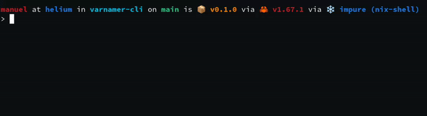

## Varnamer

A command line utility to name stuff.

### Usage

This will proudce a semantically meaningful name for your line of code

```
varnamer [CODE]
```



### Why?

Naming is a hard problem. You want to jump quickly to your terminal and get a good name without thinking. 

**Don't be this guy**


### Install

For the moment, only building from source with cargo is supported

```
cargo install varnamer
```